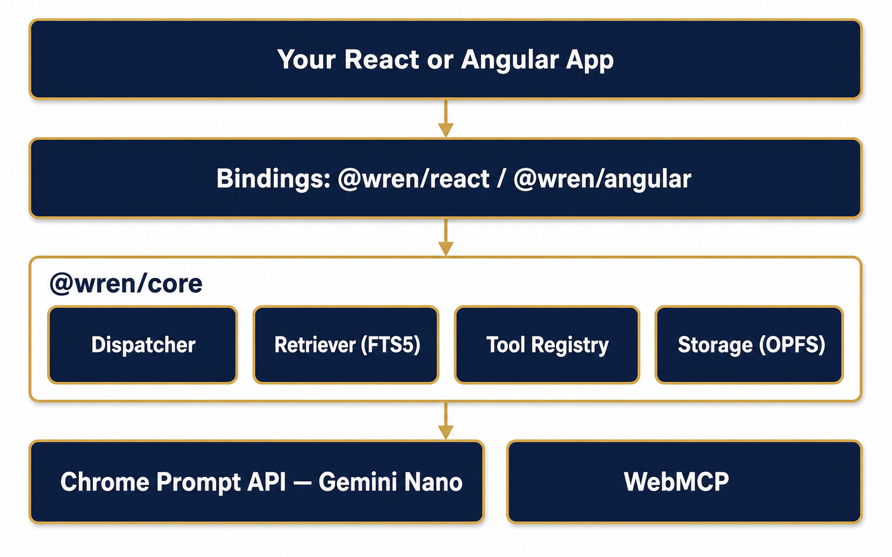

<p align="center">
  
</p>

<h1 align="center">Wren</h1>

<p align="center">
  A browser-native agent framework for React and Angular, built on<br />
  Gemini Nano, WebMCP, and vectorless retrieval.
</p>

<p align="center">
  
  
  
  
  
</p>

---

Wren lets a Chrome tab answer questions and act on your app's own content
and tools, entirely on-device. There is no server. Every model call runs
against Gemini Nano through the Chrome Prompt API, retrieval is a lexical
FTS5 prefilter over a shallow section tree instead of an embeddings
pipeline, and the only surface Wren can act through is WebMCP. Nothing
ingested, asked, or answered ever leaves the browser tab.

## Why Wren

- **On-device only.** No API keys, no inference bill, no network round
  trip. Gemini Nano runs locally via the Chrome Prompt API; if it is
  unavailable, Wren degrades instead of failing.
- **Vectorless retrieval.** A BM25-style FTS5 prefilter plus a shallow,
  LLM-navigable section tree replace an embeddings pipeline entirely. No
  vector database, no chunking heuristics to tune.
- **WebMCP as the only tool surface.** Wren's dispatcher can act through
  `navigator.modelContext` and nothing else, so what your app exposes as a
  tool is exactly what the model can do.
- **Framework-agnostic core.** `@wren/core` has zero UI dependencies.
  `@wren/react` and `@wren/angular` are thin bindings over the same
  dispatcher, retriever, and storage.
- **Small and auditable by design.** A hop-capped dispatcher, an ordered
  token-budget truncation strategy, and a page-scale corpus target keep
  Wren's behavior easy to reason about end to end.

## Architecture

<p align="center">
  
</p>

Every layer below your application code ships in `@wren/core` and has no
knowledge of React or Angular:

| Layer | Responsibility |
| --- | --- |
| `Ingestor` | Parses a source into a shallow section tree, labels each section (Nano when available, a heuristic fallback otherwise), and indexes it for retrieval. |
| `Dispatcher` | Decides, per query, whether to answer directly, call a tool, navigate one hop deeper into the section tree, or report nothing found. Navigation is hard-capped at one hop. |
| `LexicalRetriever` | BM25-weighted FTS5 search over section headings and content; no embeddings involved. |
| `ToolRegistry` | Bridges Dispatcher tool calls to `navigator.modelContext`, the WebMCP tool surface. |
| `Document Store` | SQLite WASM over OPFS (the SAHPool VFS), running in a Web Worker so the main thread never blocks on storage I/O. |

## Packages

| Package | What it is |
| --- | --- |
| [`packages/core`](packages/core) | `@wren/core`, the framework-agnostic dispatcher, retriever, storage, and Nano adapter. Zero UI dependencies. |
| [`packages/react`](packages/react) | `@wren/react`: `WrenProvider`, `useWren`, `useTool`. |
| [`packages/angular`](packages/angular) | `@wren/angular`: `WrenService`, `WrenToolDirective`. |
| [`examples/react-demo`](examples/react-demo) | A form-filling copilot built on `@wren/react`, ingesting real guidance documents and citing sources for every field it fills. |
| [`examples/angular-demo`](examples/angular-demo) | The Angular counterpart to `react-demo`. |
| [`evals`](evals) | A browser-based eval harness for scoring retrieval and dispatch quality against a fixture corpus. |

## Quickstart

```bash
pnpm add @wren/core @wren/react   # or @wren/angular
```

```tsx
import { WrenProvider, useWren, useTool } from '@wren/react';

function Assistant() {
  const { wren, status } = useWren();

  useTool({
    name: 'get_current_user',
    description: "Returns the signed-in user's display name.",
    inputSchema: { type: 'object', properties: {} },
    execute: async () => ({ content: currentUser.name }),
  });

  const ask = async (question: string) => {
    if (status !== 'ready') return;
    const response = await wren!.query(question);
    console.log(response.answer, response.citations);
  };

  // ...
}

export function App() {
  return (
    <WrenProvider>
      <Assistant />
    </WrenProvider>
  );
}
```

Run an example locally:

```bash
pnpm install
pnpm --filter react-demo dev
```

## Scope contract

**In scope**

- Client-side only. No server, no network calls at runtime.
- Gemini Nano only as the model.
- WebMCP as the only tool surface.
- Vectorless retrieval: FTS5 plus a shallow section tree, capped at one
  navigation hop.
- Small, page-scale corpora.

**Out of scope**

- Any model other than Gemini Nano.
- Embeddings or vector storage of any kind.
- Server components or API routes.
- Multi-hop autonomous planning beyond the capped dispatcher.
- Vue, Svelte, or any binding beyond React and Angular.

## Requirements

- Chrome desktop with the Prompt API and the on-device Nano model
  available.
- The WebMCP origin trial or flag, for the tool bridge to external agents.
  Wren's own dispatcher works without it.
- No Cross-Origin-Opener-Policy or Cross-Origin-Embedder-Policy headers are
  required for storage. `WrenStorage` uses the OPFS SAHPool VFS, which does
  not rely on `SharedArrayBuffer` or `Atomics.wait` the way the default
  `opfs` VFS does. It does need to run in a Worker, since
  `FileSystemFileHandle.createSyncAccessHandle()` is only available there,
  not on the main UI thread.

## Development

```bash
pnpm install
pnpm build
pnpm test
pnpm lint
pnpm typecheck
```

## Status

Under active, phased development. The public API will change while WebMCP
is in origin trial.

## License

Apache-2.0. See [`LICENSE`](LICENSE).

---

<p align="center">
  <sub>Maintained by Mohamed Yasser | Solutions Architect</sub>
</p>
